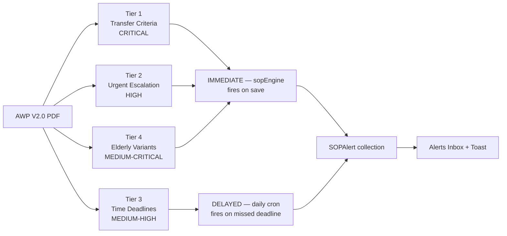
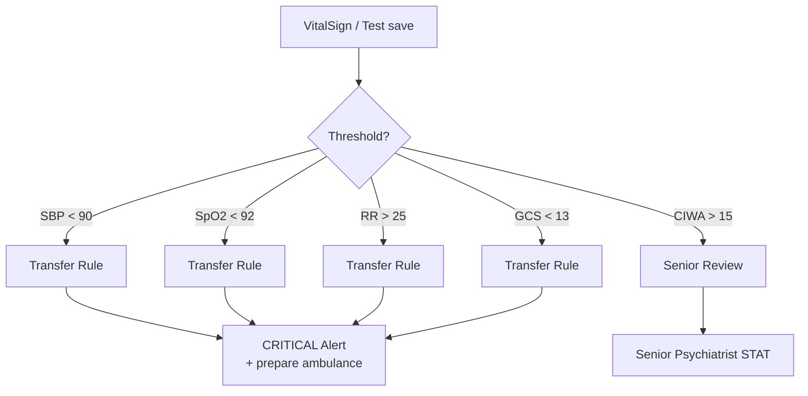
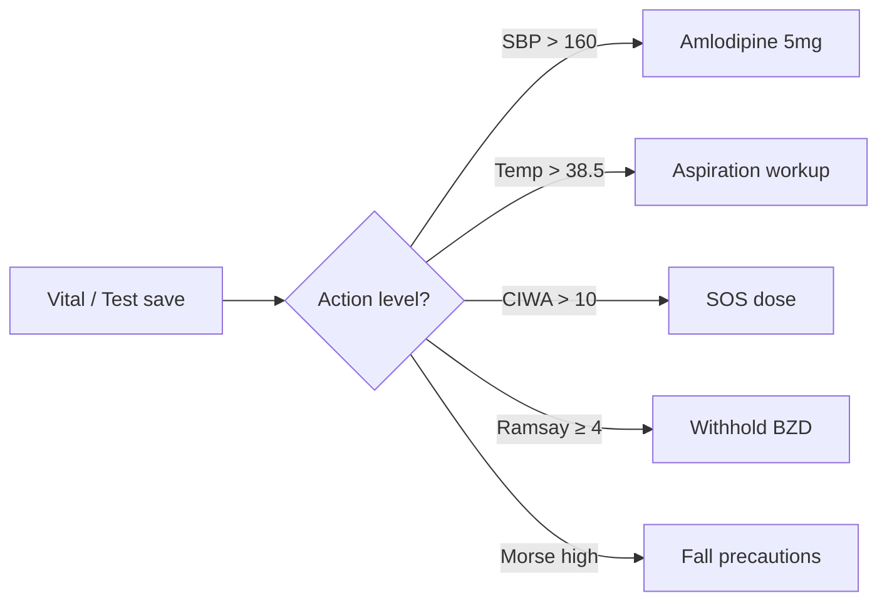
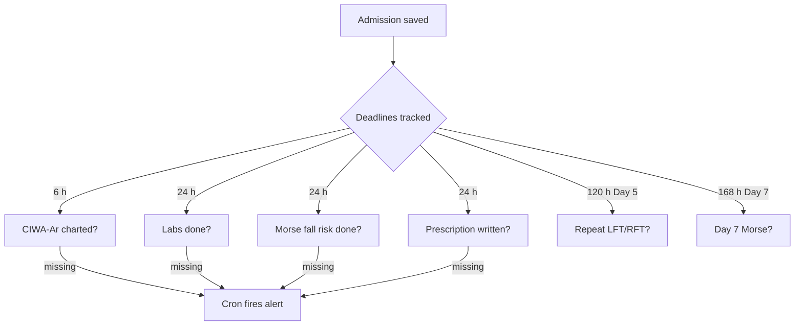
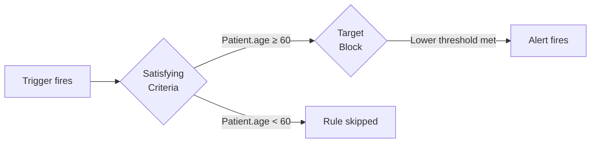
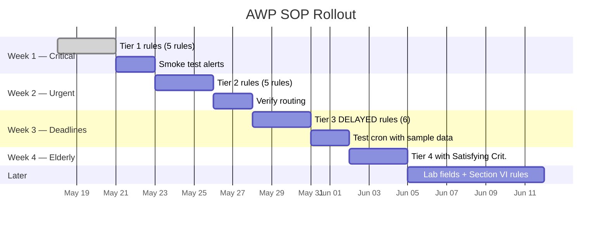

# Alcohol Withdrawal Protocol — SOP Setup Guide

**Source protocol:** Jagruti Rehabilitation Centre — Alcohol Withdrawal Management Protocol, **Version 2.0**, Protocol No. **JRC/DA/AWP/002** (Rev. April 2026).

This guide walks you through configuring **every actionable SOP rule** that the AWP V2.0 document defines. Each rule is shown as a copy-paste recipe with the exact form values, mapped to the PDF section it comes from. Use the rollout order at the bottom — don't try to enter all 30+ rules in one sitting.

---

## How to read this document

Every rule below is presented as a small block like this:

```
┌─ Rule: AWP-Hypotension-Transfer ────────────────────────┐
│ Severity:        CRITICAL                                │
│ Source:          Section VIII.D                          │
│ Trigger:         IMMEDIATE                               │
│ Target Block:                                            │
│   • VitalSign · bloodPressure.systolic · LESS_THAN · 90  │
│ Alert Template:                                          │
│   Patient {patient.name} SBP {field.value} — transfer    │
│ Routing:         PHYSICIAN, NURSING_SUPERVISOR           │
│ Action Guidance: See Section VIII.D                      │
└──────────────────────────────────────────────────────────┘
```

Open `/sop-configs/create`, fill the form exactly as shown, click **Create SOP Rule**.

---

## Field reference

These are the `Model / field` pairs you'll see in the form's "Condition" rows.

| Protocol parameter | Model | Field path |
|---|---|---|
| Systolic BP | `VitalSign` | `bloodPressure.systolic` |
| Diastolic BP | `VitalSign` | `bloodPressure.diastolic` |
| Pulse | `VitalSign` | `pulse` |
| Respiration rate | `VitalSign` | `respirationRate` |
| SpO2 | `VitalSign` | `spo2` |
| Temperature | `VitalSign` | `temprature` *(stored typo)* |
| Blood sugar | `VitalSign` | `bloodSugar` |
| CIWA-Ar score | `ciwaTest` | `systemTotalScore` |
| Ramsay sedation | `ramsaySedationTest` | `systemTotalScore` |
| Morse fall risk | `morseTest` | `systemTotalScore` |
| Glasgow Coma score | `glasgowTest` | `systemTotalScore` |
| Patient age | `Patient` | `age` |
| Patient gender | `Patient` | `gender` |
| "Document exists" check | *(any)* | `FIELD_EXISTS` |

> **Lab values (AST, ALT, Bilirubin, Creatinine, Ammonia, electrolytes)** referenced in Section VI cannot be encoded as numeric thresholds today — `LabReport` only exposes `reports.aiResponse` and `reports.aiStatus`. The deadline-based "labs must be done" rules (Tier 3 below) work fine via `FIELD_EXISTS`. The specific-value rules are deferred until the LabReport field catalogue is expanded.

---

## Where every rule fits in the system



---

# TIER 1 — Transfer Criteria (CRITICAL)

These map to **Section VIII** of the AWP document — *"Transfer Criteria — When to Refer to Higher Centre"*. Every rule here is `Severity: CRITICAL`. Route to `PHYSICIAN`, `NURSING_SUPERVISOR`, and the Clinical Director's specific user.



### Rule 1 — Hypotension (transfer trigger)

```
Rule Name:        AWP-Hypotension-Transfer
Severity:         CRITICAL
Source:           Section VIII.D — "Any system + Haemodynamic instability (SBP < 90)"
Satisfying:       (empty)
Target Block:
  • VitalSign · bloodPressure.systolic · LESS_THAN · 90 · IMMEDIATE
Alert Template:
  Patient {patient.name} SBP {field.value} mmHg — haemodynamic instability,
  prepare transfer
Routing:          PHYSICIAN, NURSING_SUPERVISOR
Action Guidance:
  Section VIII.D: SBP < 90 + any system = transfer immediately.
  Stabilise IV access, O2 if SpO2 < 92%, call receiving hospital ER.
Reference:        Section VIII.D — Two or More Organ Systems
```

### Rule 2 — Hypoxia

```
Rule Name:        AWP-Hypoxia-Transfer
Severity:         CRITICAL
Source:           Section VIII.C.1 — SpO2 < 92% on room air
Target Block:
  • VitalSign · spo2 · LESS_THAN · 92 · IMMEDIATE
Alert Template:
  Patient {patient.name} SpO2 {field.value}% — start O2, prepare transfer
Routing:          PHYSICIAN, NURSING_SUPERVISOR
Action Guidance:
  Section VIII.C.1: hypoxaemia → oxygen therapy, potential ventilatory
  support beyond facility capacity.
```

### Rule 3 — Severe Tachypnea

```
Rule Name:        AWP-Tachypnea-Severe
Severity:         CRITICAL
Source:           Section VIII.C.2 — RR > 25
Target Block:
  • VitalSign · respirationRate · GREATER_THAN · 25 · IMMEDIATE
Alert Template:
  Patient {patient.name} RR {field.value} — respiratory distress
Action Guidance:
  Section VIII.C.2: respiratory distress, aspiration pneumonia or sepsis
  risk; consider transfer.
```

### Rule 4 — GCS Drop (altered sensorium)

```
Rule Name:        AWP-GCS-Drop
Severity:         CRITICAL
Source:           Section VIII.D — "Any system + GCS < 13"
Target Block:
  • glasgowTest · systemTotalScore · LESS_THAN · 13 · IMMEDIATE
Alert Template:
  Patient {patient.name} GCS {field.value} — altered sensorium, transfer
Action Guidance:
  Section VIII.D: GCS < 13 = altered sensorium → transfer trigger.
  Prepare immediately.
```

### Rule 5 — CIWA-Ar Critical (senior review)

```
Rule Name:        AWP-CIWA-Critical
Severity:         CRITICAL
Source:           Section IX — "CIWA-Ar > 15: Immediate senior psychiatrist review"
Target Block:
  • ciwaTest · systemTotalScore · GREATER_THAN · 15 · IMMEDIATE
Alert Template:
  Patient {patient.name} CIWA-Ar {field.value} — senior review
Action Guidance:
  Section IX Escalation Pathway: CIWA-Ar > 15 → immediate senior
  psychiatrist / physician review.
```

---

# TIER 2 — Urgent Clinical Escalation (HIGH)

These come from **Section II** (treatment thresholds), **Section V.D** (elderly monitoring), and **Section IX** (escalation). Severity `HIGH`.



### Rule 6 — Hypertension (action threshold)

```
Rule Name:        AWP-Hypertension-SBP160
Severity:         HIGH
Source:           Section II.3.D — Amlodipine 5mg if BP > 140/90; escalate
Target Block:
  • VitalSign · bloodPressure.systolic · GREATER_THAN · 160 · IMMEDIATE
Alert Template:
  Patient {patient.name} SBP {field.value} — administer Amlodipine STAT
Action Guidance:
  Section II.3.D: Tab. Amlodipine 5 mg STAT then review.
  Escalate if persistent.
```

### Rule 7 — Fever (aspiration screen)

```
Rule Name:        AWP-Fever-Aspiration
Severity:         HIGH
Source:           Section VIII.C.3 — Fever + productive cough + crackles
Target Block:
  • VitalSign · temprature · GREATER_THAN · 38.5 · IMMEDIATE
Alert Template:
  Patient {patient.name} Temp {field.value}°C — assess for aspiration
Action Guidance:
  Section VIII.C.3: rule out aspiration / community-acquired pneumonia.
  IV antibiotics + cultures if confirmed. Consider transfer.
```

### Rule 8 — CIWA-Ar SOS threshold

```
Rule Name:        AWP-CIWA-SOS
Severity:         HIGH
Source:           Section II.1 SOS rule — "CIWA-Ar > 10"
Target Block:
  • ciwaTest · systemTotalScore · GREATER_THAN · 10 · IMMEDIATE
Alert Template:
  Patient {patient.name} CIWA-Ar {field.value} — administer SOS CDZ
Action Guidance:
  Section II.1: CDZ 10 mg PO PRN every 6 hours. Max 4 SOS tabs/day.
  Re-assess hourly. Adult standard; for elderly see Rule 19.
```

### Rule 9 — Ramsay over-sedation

```
Rule Name:        AWP-Oversedation
Severity:         HIGH
Source:           Section V.D + Section IX — "Ramsay ≥ 4: withhold next dose"
Target Block:
  • ramsaySedationTest · systemTotalScore · GREATER_THAN_OR_EQUAL · 4 · IMMEDIATE
Alert Template:
  Patient {patient.name} Ramsay {field.value} — withhold next BZD
Action Guidance:
  Section IX: Ramsay ≥ 4 → withhold next dose; STAT senior review.
  For elderly, this is the threshold for fall-prevention protocol.
```

### Rule 10 — Morse high fall risk

```
Rule Name:        AWP-Fall-Risk-High
Severity:         MEDIUM
Source:           Section V.D — Morse "High risk"
Target Block:
  • morseTest · systemTotalScore · GREATER_THAN_OR_EQUAL · 45 · IMMEDIATE
Alert Template:
  Patient {patient.name} Morse score {field.value} — apply fall precautions
Action Guidance:
  Section V.D: bed rails, non-slip footwear, carer alert.
  Document hourly observation if elderly.
```

> Verify `45` matches your Morse cut-off. The protocol just says "high risk"; 45+ is the standard published threshold.

---

# TIER 3 — Time-Based Deadlines (DELAYED)

These come from **Section I** (mandatory investigations on admission) and **Section V.D** (mandatory elderly monitoring schedule). They fire from the daily cron when an expected document hasn't been recorded by its deadline.



### Rule 11 — Baseline labs (Day 1)

```
Rule Name:        AWP-Baseline-Labs-Day1
Severity:         HIGH
Source:           Section I — "Mandatory Baseline Investigations (all admissions)"
Target Block:
  • LabReport · FIELD_EXISTS · EXISTS · DELAYED · 24 hours
Alert Template:
  Baseline LFT/RFT/CBC overdue for {patient.name} — 24h past admission
Action Guidance:
  Section I: CBC | LFT | RFT | Electrolytes | RBS | Ammonia | PT/INR | ECG.
  Required BEFORE initiating or continuing benzodiazepine therapy.
```

### Rule 12 — First CIWA-Ar within 6h

```
Rule Name:        AWP-First-CIWA-6h
Severity:         HIGH
Source:           Section IX — "CIWA-Ar score at every nursing assessment
                  (minimum every 6 hours Days 1–7)"
Target Block:
  • ciwaTest · FIELD_EXISTS · EXISTS · DELAYED · 6 hours
Alert Template:
  No CIWA-Ar charted within 6h of admission for {patient.name}
```

### Rule 13 — Initial prescription within 24h

```
Rule Name:        AWP-First-Prescription-24h
Severity:         HIGH
Source:           Section II — fixed-dose CDZ protocol begins Day 1
Target Block:
  • Prescription · FIELD_EXISTS · EXISTS · DELAYED · 24 hours
Alert Template:
  No initial prescription for {patient.name} 24h after admission
Action Guidance:
  Section II.1: Day 1 = 4-4-6 CDZ tabs (adult) or 2-2-3 (elderly).
  Plus antiepileptic + Thiamine + B-Plex.
```

### Rule 14 — Morse Fall Risk on admission

```
Rule Name:        AWP-Morse-On-Admission
Severity:         MEDIUM
Source:           Section V.D — "Fall Risk Assessment (Morse Scale): On admission"
Target Block:
  • morseTest · FIELD_EXISTS · EXISTS · DELAYED · 24 hours
Alert Template:
  Morse Fall Risk not recorded for {patient.name} (24h post admission)
```

### Rule 15 — Day 5 LFT/RFT repeat

```
Rule Name:        AWP-Day5-LFT-Repeat
Severity:         MEDIUM
Source:           Section V.D — "LFT / RFT: Day 1 baseline + Day 5"
Target Block:
  • LabReport · FIELD_EXISTS · EXISTS · DELAYED · 120 hours
Alert Template:
  Day 5 LFT/RFT repeat overdue for {patient.name}
```

> **Caveat about repeat-deadline rules:** the current cron checks "does any LabReport exist since admission?" — so once Day 1 labs are filed, this rule's condition is satisfied forever after. To actually require a *new* LabReport on Day 5, the cron logic needs enhancement to look for `createdAt >= admission.createdAt + 96h` instead. Worth a follow-up before relying on Day 5 / Day 7 repeats.

### Rule 16 — Day 7 Morse repeat

```
Rule Name:        AWP-Day7-Morse-Repeat
Severity:         MEDIUM
Source:           Section V.D — "Fall Risk: On admission, Day 3, Day 7"
Target Block:
  • morseTest · FIELD_EXISTS · EXISTS · DELAYED · 168 hours
Alert Template:
  Day 7 Morse Fall Risk reassessment overdue for {patient.name}
```

---

# TIER 4 — Elderly-Specific (Age ≥ 60)

These use **Section V** — "*Dose Adjustments — Elderly Patients (Age ≥ 60 Years)*". The **Satisfying Criteria** field is the right tool here — it acts as a global filter, so the rule only fires when the patient meets the age condition.



### Rule 17 — Elderly hypertension (lower BP threshold)

```
Rule Name:        AWP-Elderly-Hypertension
Severity:         HIGH
Source:           Section V.C — "Amlodipine 2.5 mg (HALF dose) for BP > 150/95
                  in elderly"
Satisfying Criteria:
  • Patient · age · GREATER_THAN_OR_EQUAL · 60 · IMMEDIATE
Target Block:
  • VitalSign · bloodPressure.systolic · GREATER_THAN · 150 · IMMEDIATE
Alert Template:
  Elderly patient {patient.name} SBP {field.value} — Amlodipine 2.5 mg
Action Guidance:
  Section V.C: half adult dose (2.5 mg). Re-assess within 30 min.
```

### Rule 18 — Elderly Ramsay (lower sedation threshold)

```
Rule Name:        AWP-Elderly-Oversedation-Sensitive
Severity:         HIGH
Source:           Section V.D — elderly sedation vigilance
Satisfying Criteria:
  • Patient · age · GREATER_THAN_OR_EQUAL · 60 · IMMEDIATE
Target Block:
  • ramsaySedationTest · systemTotalScore · GREATER_THAN_OR_EQUAL · 3 · IMMEDIATE
Alert Template:
  Elderly {patient.name} Ramsay {field.value} — withhold sedative, senior review
Action Guidance:
  Section V Rationale: elderly have exaggerated CNS depression and paradoxical
  excitation; threshold is lowered from 4 to 3 for safety.
```

### Rule 19 — Elderly SOS CIWA (reduced max)

```
Rule Name:        AWP-Elderly-CIWA-SOS
Severity:         HIGH
Source:           Section V.A SOS note — "MAXIMUM 2 SOS tabs/day" (elderly)
Satisfying Criteria:
  • Patient · age · GREATER_THAN_OR_EQUAL · 60 · IMMEDIATE
Target Block:
  • ciwaTest · systemTotalScore · GREATER_THAN · 10 · IMMEDIATE
Alert Template:
  Elderly {patient.name} CIWA {field.value} — SOS CDZ (max 2/day, 8h interval)
Action Guidance:
  Section V.A: CDZ 10 mg every 8 hours PRN (not 6h). MAX 2 SOS tabs/day.
  Reassess every 2 hours after dose. Consider Lorazepam 0.5 mg IM.
```

### Rule 20 — Elderly hypotension (earlier flag)

```
Rule Name:        AWP-Elderly-Hypotension-Early
Severity:         HIGH
Source:           Section V rationale — elderly BP sensitivity
Satisfying Criteria:
  • Patient · age · GREATER_THAN_OR_EQUAL · 60 · IMMEDIATE
Target Block:
  • VitalSign · bloodPressure.systolic · LESS_THAN · 100 · IMMEDIATE
Alert Template:
  Elderly {patient.name} SBP {field.value} — flag early, review meds
Action Guidance:
  Elderly tolerate hypotension poorly. Flag at 100 mmHg rather than 90
  (which is the universal transfer threshold).
```

---

# Rules deferred (need system extension)

These exist in the protocol but **can't be encoded yet**. Notes for what to do later.

| AWP reference | Reason deferred | What to add |
|---|---|---|
| Section VI.A — AST/ALT > 120 / > 200 / > 400 | `LabReport.tests.*` not in field catalogue | Expose `tests.ast`, `tests.alt`, etc. in `ALLOWED_FIELDS.LabReport` |
| Section VI.B — Bilirubin > 3.6 | Same as above | Expose `tests.bilirubin` |
| Section VI.C — Creatinine > 3.6, eGFR < 30 | Same | Expose `tests.creatinine`, `tests.eGFR` |
| Section VI.D — Ammonia > 105 | Same | Expose `tests.ammonia` |
| Section VI.E — Na < 120, K < 2.5, Mg < 0.4 | Same | Expose `tests.sodium`, etc. |
| Section VIII.C.4 — "GCS drop + RR > 20 + SpO2 < 95%" | Requires temporal comparison (delta from baseline) | Add a new operator that compares to most-recent prior record |
| Section VIII.D — "Refractory seizures (> 2 episodes)" | Requires counting events in a window | Add windowed-count aggregation |

---

# Rollout order (suggested)



**Why this order:**
1. **Tier 1 first** because the cost of a missed CRITICAL alert is highest. Verify each one fires correctly before adding more.
2. **Tier 2** uses the same mechanism as Tier 1 — once Tier 1 is proven, the form muscle memory is in place.
3. **Tier 3** changes the trigger mechanism (cron-driven instead of save-driven). Test the cron once with realistic data before adding all deadline rules.
4. **Tier 4** introduces `Satisfying Criteria` — first time the global filter is exercised. Verify with one elderly + one non-elderly patient before stacking.
5. **Lab-value rules** wait for the field-catalogue expansion.

---

# Verification checklist

After creating each rule, verify in MongoDB:

```js
// Did it land in the rules collection with correct shape?
db.soprules.findOne({ ruleName: "AWP-Hypotension-Transfer" })

// Trigger the rule by submitting a matching VitalSign / test record.
// Then check:
db.sopalerts.find({ rule: <ruleId> }).sort({ createdAt: -1 }).limit(1).pretty()
```

Expect to see:
- `severity`, `message` (with placeholders filled in)
- `routing.notifyRoles` matching what you set
- `center: ObjectId(...)` for VitalSign/Prescription/LabReport triggers
- `center: null` for ciwaTest/ramsaySedationTest/morseTest/glasgowTest triggers (until clinical-test center resolution is added)
- `dedupeKey: null` for IMMEDIATE; `dedupeKey: <ruleId>:<admId>:<bIdx>:<cIdx>` for DELAYED

---

# Quick reference summary

| Tier | Rules | Severity | Mechanism | PDF Sections |
|---|---|---|---|---|
| 1 — Transfer Criteria | 5 | CRITICAL | IMMEDIATE | VIII.D, VIII.C, IX |
| 2 — Urgent Escalation | 5 | HIGH / MEDIUM | IMMEDIATE | II, V.D, IX, VIII.C |
| 3 — Time Deadlines | 6 | HIGH / MEDIUM | DELAYED (cron) | I, V.D, IX |
| 4 — Elderly Variants | 4 | HIGH | IMMEDIATE + Satisfying Criteria | V |
| **Total ready today** | **20** | | | |
| Deferred (lab values, temporal patterns) | ~10 | | needs system extension | VI, VIII.C.4 |

---

*Protocol version: AWP V2.0 (JRC/DA/AWP/002), April 2026. Re-review this guide whenever a new protocol version is published — threshold values may shift.*
