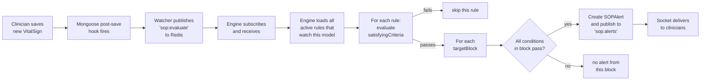
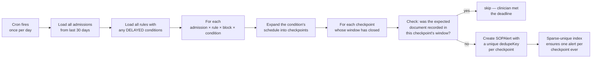
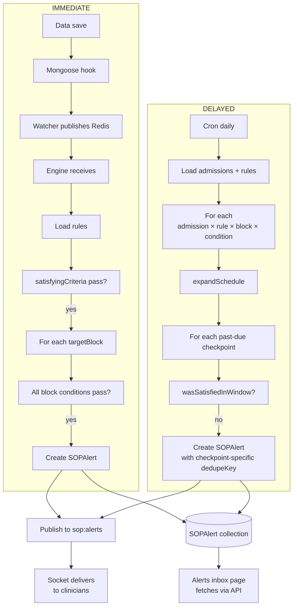

# SOP Condition Evaluation — How It Works Internally

A simple, end-to-end explanation of how the SOP engine decides whether to fire an alert. No prior knowledge required.

---

## What is a "condition" in plain English

A **condition** is a single clinical check the system can make about a patient. It has four pieces, like a sentence:

> *"Look at the patient's **VitalSign** record, find the **bloodPressure.systolic** field, check if it is **LESS_THAN** the value **90**."*

Mapped to the data:

| Sentence part | Field name | Example value |
|---|---|---|
| Look at the patient's __X__ record | `model` | `"VitalSign"` |
| Find the __Y__ field | `field` | `"bloodPressure.systolic"` |
| Check if it is __Z__ | `operator` | `"LESS_THAN"` |
| the value __N__ | `value` | `[90]` (always an array in DB) |

That's it. A condition is the smallest unit of "if this is true then…".

---

## Conditions live in two places inside a rule

A SOP rule is a recipe. It has two slots for conditions, and they do different jobs:

```
┌────────────────────────────────────────────────────────┐
│ SOPRule                                                 │
│                                                         │
│   satisfyingCriteria   ←  "Does this rule apply to     │
│       (conditions)         this patient at all?"        │
│                                                         │
│   targetBlocks         ←  "If yes, when should the     │
│       (each has its         alert fire?"               │
│        own conditions)                                  │
│                                                         │
└────────────────────────────────────────────────────────┘
```

**`satisfyingCriteria`** = the *patient gate*. ALL of its conditions must pass, otherwise the rule is skipped entirely for this patient. Example: *"only apply this rule to admitted alcohol-withdrawal patients."*

**`targetBlocks`** = the *alert recipes*. Each block is independent — when ALL conditions in one block pass, that block fires its own alert. A rule with 3 blocks can produce 0, 1, 2, or 3 alerts at the same time.

---

## Two trigger types — how the engine knows when to look

Every condition has a `triggerType`:

| Type | When does the engine look at it? |
|---|---|
| **IMMEDIATE** | The instant a new document is saved (e.g., a clinician submits a new VitalSign). |
| **DELAYED** | At a scheduled time — driven by the daily cron job. |

The two paths are completely separate. They never trigger each other.

---

## IMMEDIATE path — the live alert flow



### Step-by-step with a real example

**Rule**: *"Alert nursing if hypoxia on an admitted patient."*
- `satisfyingCriteria.conditions`: `Patient.isAdmit EQUALS true`
- `targetBlocks[0].conditions`: `VitalSign.spo2 LESS_THAN 92`

**What happens when a clinician saves a VitalSign with `spo2: 88`:**

1. Mongoose's `post('save')` hook fires on the new VitalSign document.
2. The watcher publishes a Redis message: *"Hey, a VitalSign was just saved — payload attached."*
3. The engine, subscribed to that channel, receives the message.
4. Engine asks: *"Are there any active rules where at least one condition references `VitalSign` with `triggerType: IMMEDIATE`?"* It finds our rule.
5. Engine loads the patient (the one referenced in the VitalSign's `patient` field).
6. Engine evaluates `satisfyingCriteria`:
   - Condition 1: `Patient.isAdmit EQUALS true`. The patient's `isAdmit` is `true`. **Pass.**
   - All conditions passed → proceed to target blocks.
7. Engine evaluates `targetBlocks[0]`:
   - Condition 1: `VitalSign.spo2 LESS_THAN 92`. The just-saved VitalSign has `spo2: 88`. `88 < 92` → **Pass.**
   - Block passes overall.
8. `SOPAlert.create({ ..., severity, message, routing })` writes the alert to the database.
9. The engine publishes the new alert to the `sop:alerts` Redis channel.
10. The socket service forwards it to all connected nursing clinicians.

Total time end-to-end: usually under 100ms.

---

## DELAYED path — the scheduled / time-based flow

DELAYED conditions don't fire on data events. They're for protocol rules like *"a lab must be done by Day 1 post-admission"* — meaning the engine periodically checks whether an expected document exists.



The key trick: **one DELAYED condition can produce many "checkpoints"** — each checkpoint is its own one-time question. The cron asks each question independently.

### The three period types

A DELAYED condition's `schedule.period` tells the cron how to lay out its checkpoints.

#### Period = DEADLINE

> *"The expected document must be recorded by admission + N hours."*

One checkpoint, one window.

```
admission                             admission + N + grace
   │                                              │
   ▼              window (one)                    ▼
   ●═══════════════════════════════════════════════╣
```

**Example**: *"Lab report due within 24h of admission."*  
`{ period: "DEADLINE", intervalHours: 24, graceHours: 0 }`  
→ One checkpoint at hour 24. If no LabReport saw within the first 24h, alert.

#### Period = CONTINUOUS

> *"The expected document must keep being recorded every N hours, until discharge."*

Many checkpoints, equally spaced.

```
admission   N    2N    3N    4N    5N    ...   discharge or now
   │        │     │     │     │     │              │
   ▼  win1  ▼ w2  ▼ w3  ▼ w4  ▼ w5  ▼              │
   ●═══════╫═════╫═════╫═════╫═════╫══════ ... ════╣
```

**Example**: *"Ramsay every 4h throughout admission."*  
`{ period: "CONTINUOUS", intervalHours: 4, graceHours: 1 }`  
→ Checkpoints at hours 4, 8, 12, 16, … etc. Each is its own window.

#### Period = DAYS

> *"The expected document must be recorded on these specific days."*

One checkpoint per listed day (a 24h window each), or sub-divided if `intervalHours` is also set.

```
Day 1                  Day 3                       Day 7
 24h window             24h window                  24h window
   │                       │                           │
   ▼                       ▼                           ▼
─[█████████]──────────[█████████]─────...────────[█████████]──
```

**Examples**:
- *"Electrolytes on Day 1, 3, 7."* — `{ period: "DAYS", days: [1, 3, 7] }`
- *"Vitals every 4h, Days 1–5."* — `{ period: "DAYS", days: [1,2,3,4,5], intervalHours: 4 }`

For each listed day, with `intervalHours` set, you get `24 / intervalHours` checkpoints. Days 1–5 × 4h = 30 checkpoints total.

---

## What is a "checkpoint window"

Every checkpoint is a **time window** the engine queries against. It asks:

> *"Was there at least one record of `<model>` for this patient with `createdAt` between `windowStart` and `windowEnd`?"*

If the condition's `field` is `FIELD_EXISTS`, that's the whole check. If it's a real field (like `spo2`), the engine fetches the record and applies the `operator` against the field value.

The window's width depends on the period:

| Period | Window |
|---|---|
| DEADLINE | `[admission, admission + intervalHours + grace]` |
| CONTINUOUS | `[slotTime − intervalHours, slotTime + grace]` (rolling window of `intervalHours`) |
| DAYS (no interval) | `[dayStart, dayEnd + grace]` (full 24h day) |
| DAYS + interval | Same as CONTINUOUS, but only within each listed day |

`grace` (the `graceHours` field, default 0) extends the window forward to give clinicians a small buffer past the strict deadline.

---

## Why each checkpoint gets its own alert

The dedup mechanism is per-checkpoint:

```
dedupeKey = "<ruleId>:<admissionId>:<blockIdx>:<condIdx>:<checkpointId>"
```

Examples:
- DEADLINE alert: `"ruleA:adm1:0:0:deadline:1715760000000"` — one possible key, ever.
- DAYS alert for Day 3: `"ruleA:adm1:0:0:d3"` — one alert for Day 3, ever.
- CONTINUOUS alert at hour 16: `"ruleA:adm1:0:0:cont:1715774400000"` — one alert for that 16h slot, ever.

The `SOPAlert.dedupeKey` field has a **sparse unique index** in MongoDB. If the cron tries to insert a duplicate key (because a re-run is checking the same already-fired checkpoint), MongoDB raises a duplicate-key error, the controller catches it, and silently skips. No double-fire ever.

This is what makes the system safe to **run as many cron cycles as you want** — even running cron every minute won't multiply alerts.

---

## What happens when many checkpoints are missed at once

This is one of the questions you asked. Concrete walkthrough:

**Scenario**: Patient admitted at 10:00 AM Day 0. Rule: *"CIWA every 6h, CONTINUOUS."* Cron runs once per day at 01:00.

The cron at 01:00 Day 1 (15 hours post-admission) sees:

| Checkpoint | Slot time | Window | Past-due? |
|---|---|---|---|
| 1 | 16:00 Day 0 | [10:00, 16:00] | ✓ yes |
| 2 | 22:00 Day 0 | [16:00, 22:00] | ✓ yes |
| 3 | 04:00 Day 1 | [22:00, 04:00] | ✓ yes (just barely closed) |
| 4 | 10:00 Day 1 | [04:00, 10:00] | ✗ no, still in future |

So **3 separate checks** happen. For each:
- If a `ciwaTest` exists with `createdAt` in that window → satisfied → no alert.
- If not → fire an alert with a checkpoint-specific dedupeKey.

You could end up with 3 alerts in the inbox, each saying "missed CIWA at 16:00/22:00/04:00". Tomorrow's cron picks up checkpoint 4 (and any new ones that emerge).

**This is correct behavior** — 3 missed checks is 3 missed clinical observations, and the inbox accurately reflects that. Running cron more often (every 1h instead of 24h) reduces alert latency but doesn't change the alert count.

---

## What happens if a schedule field is empty

Two safety nets:

### Safety net 1 — Controller validation rejects the save

Before any rule gets into MongoDB, both the create and update controllers run shape checks:

| Period | Empty field | Reject? |
|---|---|---|
| DEADLINE | `intervalHours` empty/0 | ✗ rejected with `400 — DEADLINE schedule needs intervalHours > 0` |
| CONTINUOUS | `intervalHours` empty/0 | ✗ rejected with `400 — CONTINUOUS schedule needs intervalHours > 0` |
| DAYS | `days[]` empty | ✗ rejected with `400 — DAYS schedule needs at least one day` |
| DAYS | `intervalHours` empty | ✓ allowed — falls back to "one check per day" |
| Any | `graceHours` empty | ✓ allowed — defaults to 0 |

So under normal use, broken configs never reach the engine.

### Safety net 2 — Engine fail-safe

Even if a broken config somehow slips through (manual DB edit, schema-version mismatch), the engine is defensive. `expandSchedule` produces **zero checkpoints** when required inputs are missing:

```js
if (sched.period === "DEADLINE" && intervalMs) { ... }   // skipped if intervalMs is null
```

Zero checkpoints = zero alerts. The condition silently does nothing.

This is intentional — in clinical software, doing nothing is safer than firing an alert based on bad config. Bad configs surface as "this rule never fires" rather than "this rule fires spuriously."

---

## The full pipeline at a glance



Both paths produce the same kind of artifact — a `SOPAlert` row — and both arrive in the same inbox. The clinician doesn't need to know which path fired their alert.

---

## A note on the dedup story (recap)

The dedupe trick is what makes the whole DELAYED system safe to operate. Three layers of protection:

1. **Per-checkpoint dedupeKey** — every checkpoint has its own string ID.
2. **Sparse unique index** on `SOPAlert.dedupeKey` — MongoDB rejects duplicates atomically.
3. **`E11000` silent catch** in `fireAlert` — the controller swallows the duplicate-key error so the cron run continues.

Net effect: **one missed checkpoint produces exactly one alert, no matter how often the cron runs.**

---

## Glossary

| Term | What it means |
|---|---|
| **Trigger** | The event that makes the engine look at a condition. Either a data save (IMMEDIATE) or a cron tick (DELAYED). |
| **Condition** | One question of the form "is `field` of `model` `operator` `value`?". Smallest unit. |
| **Satisfying criteria** | The patient gate. ALL its conditions must pass before any block runs. |
| **Target block** | An alert recipe — has conditions + alert template + severity + routing. |
| **Block passing** | When ALL conditions inside a block pass. One block passing = one alert fires. |
| **Checkpoint** | A specific point in time when a DELAYED condition is evaluated. |
| **Window** | The time range a checkpoint queries against. |
| **Grace hours** | Extra forgiveness time after a checkpoint's strict deadline. |
| **dedupeKey** | A unique string per (rule × admission × block × condition × checkpoint) that prevents duplicate alerts. |
| **fireAlert** | The function that actually creates a `SOPAlert` and publishes it. |
| **sopWatcher** | The Mongoose hook layer that publishes events when watched models save. |
| **sopEngine** | The Redis subscriber that evaluates rules for IMMEDIATE events. |
| **sopDelayedCheck.cron** | The daily cron that handles DELAYED conditions. |

---

## TL;DR

- A **condition** = `model + field + operator + value`. That's the atom of the system.
- **`satisfyingCriteria`** filters whether a rule applies to this patient.
- **`targetBlocks`** define what alerts to send when the rule applies.
- **IMMEDIATE** = triggered by Mongoose post-save hooks via Redis pub/sub.
- **DELAYED** = triggered by a daily cron, which expands each condition's `schedule` into checkpoints.
- Each missed checkpoint fires exactly one alert, ever, thanks to a per-checkpoint `dedupeKey` + a sparse unique index.
- Empty/invalid configs are rejected at save time; if one slips through, the engine silently no-ops — never spurious alerts.
- Cron frequency doesn't change alert correctness — only latency. Running cron more often just catches missed checkpoints sooner.
