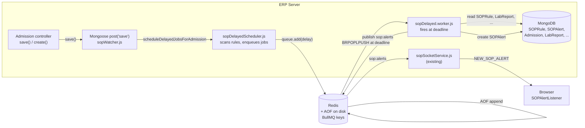
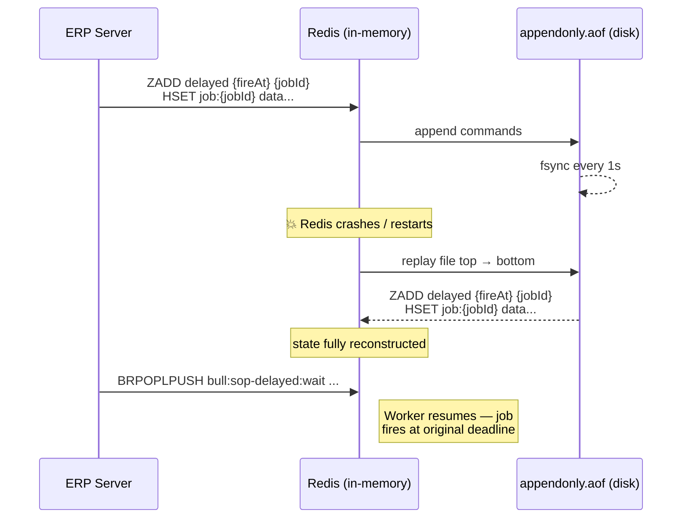

# SOP Delayed Triggers — Workflow

Time-based SOP deadlines (e.g. "lab report must be submitted within 2 hours of admission") backed by BullMQ delayed jobs with Redis AOF for durability.

---

## 1. High-level architecture



---

## 2. Lifecycle of one delayed job (2-hour LabReport deadline)

```mermaid
sequenceDiagram
    actor Clinician
    participant Adm as Admission controller
    participant Watch as sopWatcher.js
    participant Sched as sopDelayedScheduler
    participant Q as BullMQ Queue
    participant R as Redis (AOF on)
    participant W as sopDelayed Worker
    participant Eng as MongoDB
    participant Sock as sopSocketService
    participant UI as Browser

    Note over Clinician,UI: t = 10:00:00 — admission created
    Clinician->>Adm: POST /admission
    Adm->>Eng: new Addmission(...).save()
    Eng-->>Watch: post('save') fires (this.wasNew = true)
    Watch->>Watch: publish sop:evaluate (IMMEDIATE path)
    Watch->>Sched: scheduleDelayedJobsForAdmission(doc)
    Sched->>Eng: SOPRule.find({ DELAYED conditions })
    Eng-->>Sched: rules with DELAYED
    Sched->>Q: queue.add('checkDeadline', data,<br/>{ delay: 7200000, jobId: 'rule:adm:0:0' })
    Q->>R: HSET bull:sop-delayed:{jobId} ...<br/>ZADD bull:sop-delayed:delayed {fireAt} {jobId}
    R->>R: AOF append (fsync within 1s)

    Note over Clinician,UI: t = 10:00:01 → 11:59:59 — waiting (job durable on disk)

    Note over Clinician,UI: t = 11:55:00 — lab report submitted
    Clinician->>Eng: LabReport.save()
    Note right of Eng: IMMEDIATE path runs; delayed job untouched

    Note over Clinician,UI: t = 12:00:00 — deadline hits
    R->>W: BullMQ scheduler moves job<br/>delayed → wait → active
    W->>Eng: SOPRule.findById(ruleId)
    W->>Eng: Addmission.findById, Patient.findById
    W->>Eng: LabReport.findOne({ patient, createdAt ≥ admission.createdAt })

    alt LabReport exists & condition satisfied
        Eng-->>W: doc returned
        W->>W: satisfied = true → job done, no alert
    else LabReport missing or condition failed
        Eng-->>W: null / condition fails
        W->>Eng: SOPAlert.create({ ... })
        W->>R: PUBLISH sop:alerts {payload}
        R->>Sock: sop:alerts subscriber
        Sock->>UI: io.to(role_X).emit('NEW_SOP_ALERT')
        UI->>Clinician: toast.error("Deadline missed: ...")
    end
```

---

## 3. AOF durability — what survives a Redis restart



Worst-case loss with `appendfsync everysec`: ≤ 1 second of writes on hard kernel crash. Zero loss on clean restart.

---

## 4. BullMQ keys in Redis

For a queue named `sop-delayed`:

| Key | Type | Holds |
|---|---|---|
| `bull:sop-delayed:{jobId}` | Hash | Job payload + opts + attempt count |
| `bull:sop-delayed:delayed` | ZSET | jobIds scored by execute-at timestamp |
| `bull:sop-delayed:wait` | List | jobIds ready to be picked by a worker |
| `bull:sop-delayed:active` | List | jobIds currently being processed |
| `bull:sop-delayed:completed` | ZSET | recently-completed (capped at 1000) |
| `bull:sop-delayed:failed` | ZSET | recently-failed (capped at 1000) |

Inspect from a Redis client:

```
ZRANGE bull:sop-delayed:delayed 0 -1 WITHSCORES   # see scheduled deadlines
ZCARD bull:sop-delayed:delayed                    # count pending deadlines
```

---

## 5. IMMEDIATE vs DELAYED — semantic comparison

| | IMMEDIATE | DELAYED |
|---|---|---|
| Trigger | Data save (e.g. VitalSign saved) | Time elapsed (e.g. 2h since admission) |
| Mechanism | `post('save')` → Redis `sop:evaluate` channel | BullMQ delayed job → Worker at deadline |
| Alert fires when | Condition **passes** (abnormal event detected) | Condition **fails** (expected event didn't happen) |
| Example | "systolic BP > 140 → alert" | "LabReport must exist within 2h → alert if missing" |
| Output channel | `sop:alerts` (same) | `sop:alerts` (same) |
| Survives restart | N/A (instantaneous) | Yes, via Redis AOF |

Both pathways converge on the same `sop:alerts` Redis channel, so the socket service and frontend listener handle them identically.
