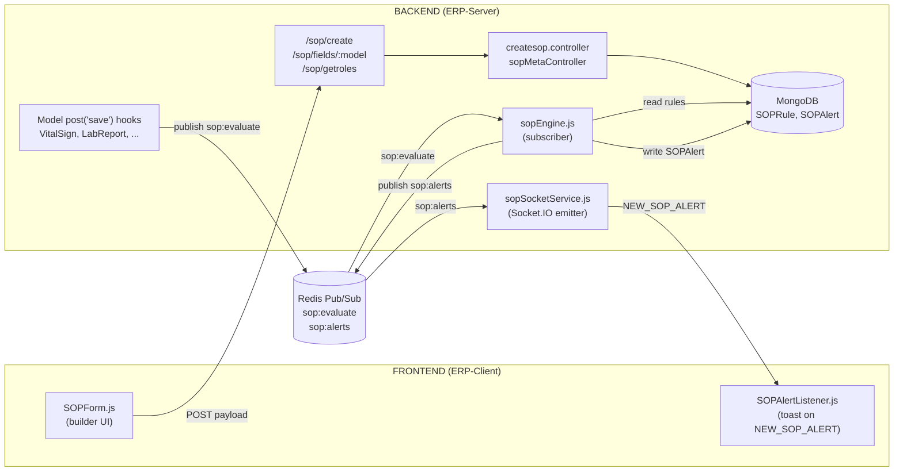
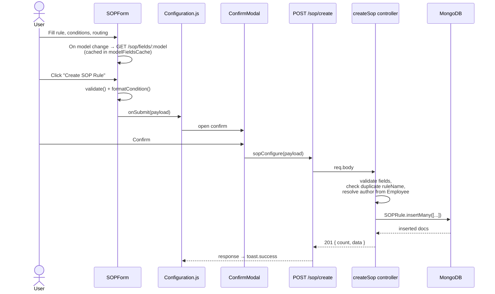
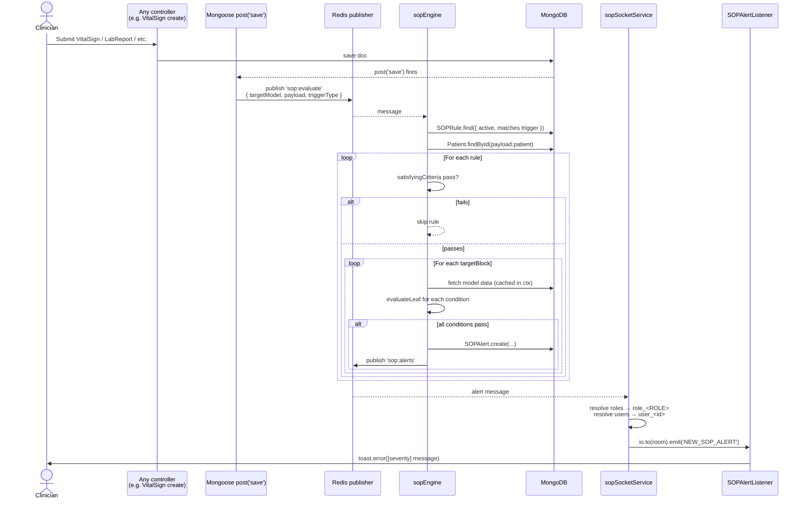
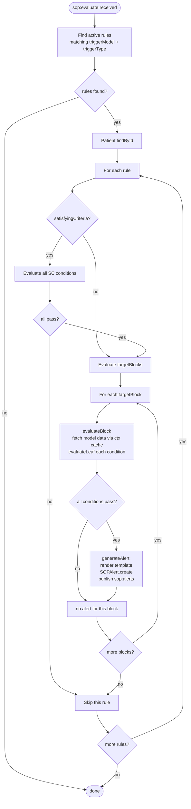
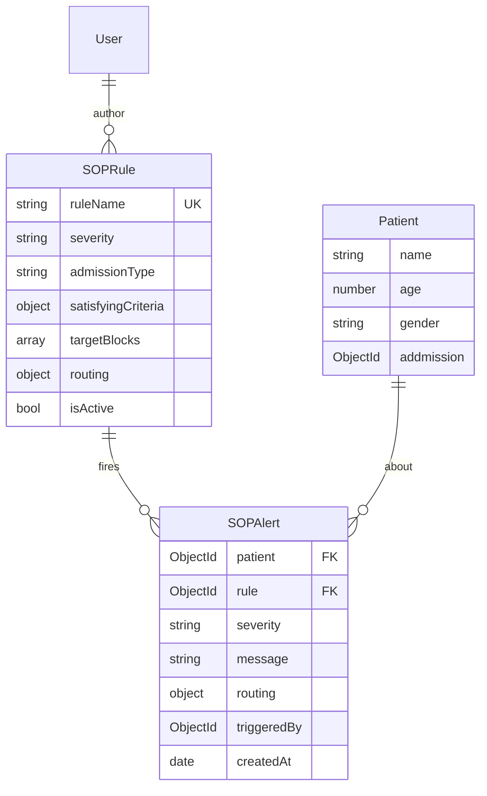
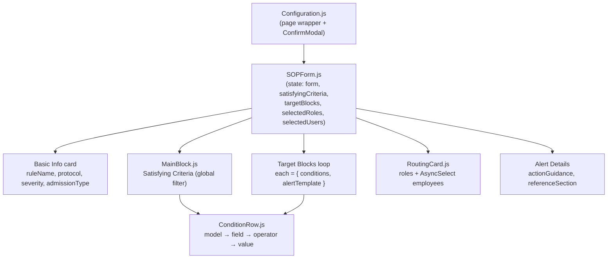
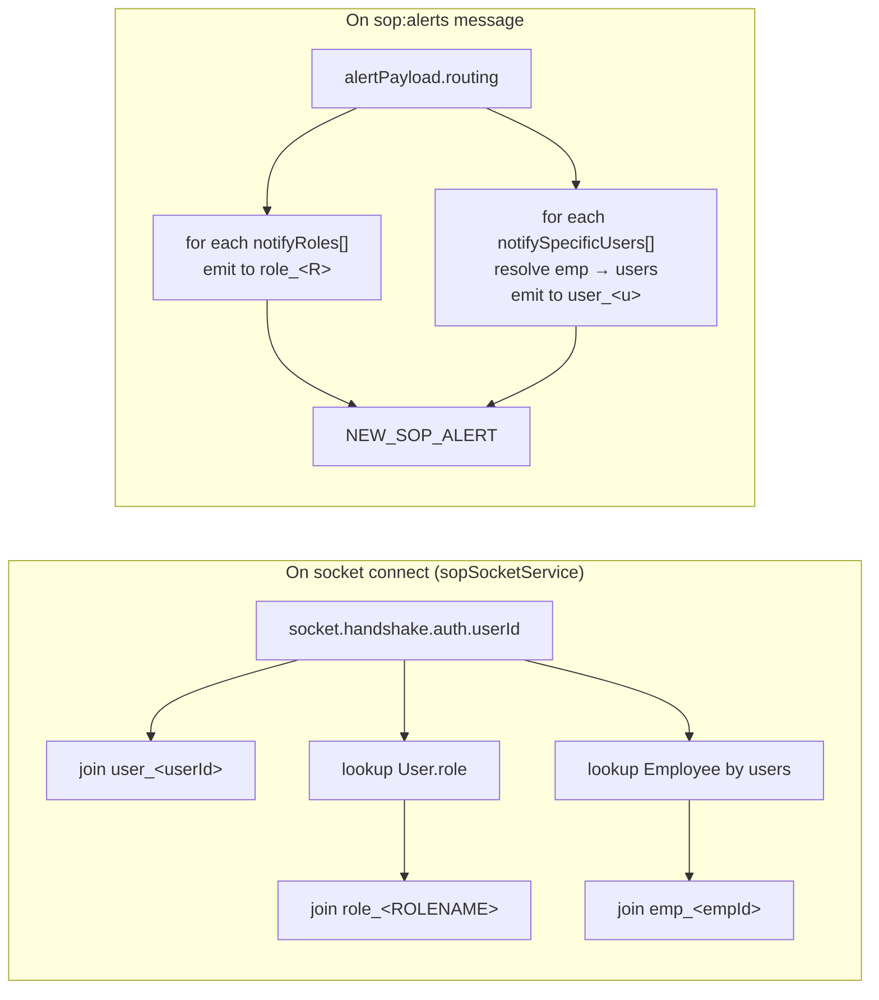

# SOP System — Workflow Graphs

Visual reference for the SOP (Standard Operating Procedure) feature.
Frontend: `ERP-Client/src/pages/SopConfigs/` · Backend: `ERP-Server/src/{routes,controllers,services}/sop/`

---

## 1. High-level architecture

---

## 2. Rule-creation workflow

---

## 3. Runtime evaluation + alert delivery

---

## 4. Per-rule evaluation logic (inside the engine)

---

## 5. Data model

---

## 6. Form structure (frontend component tree)

---

## 7. Socket room membership (who hears an alert)

---

## Quirks worth knowing

- **`admissionType` runtime check is commented out** in `sopEngine.js` (lines ~268–292) — rule's ICD/OPD/BOTH currently has no effect at evaluation time.
- **`DELAYED` trigger type** exists in schema + form but no scheduler publishes `triggerType: 'DELAYED'` events yet. The engine filters them out during IMMEDIATE evaluation.
- Only **`VitalSign`** has the `post('save')` Redis publisher today. Other `TARGET_MODELS` (`LabReport`, `Prescription`, tests, etc.) need similar hooks to trigger rules.
- All conditions inside a block are **AND'd**. To express OR, create multiple target blocks.
- `ruleName` is globally **unique** (Mongo index) — `createSop` returns 409 on duplicates.
